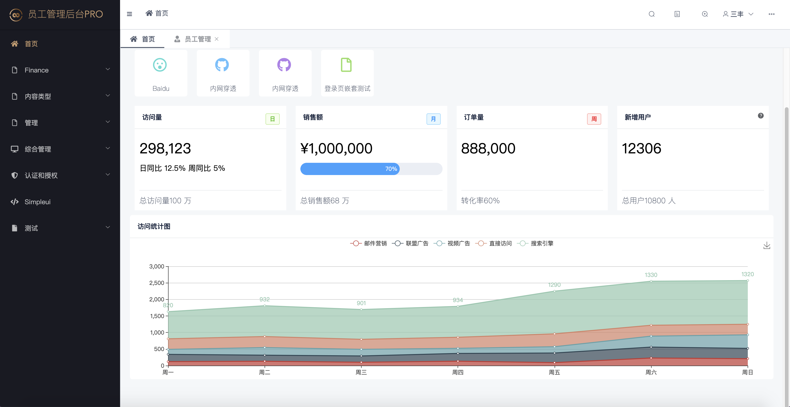
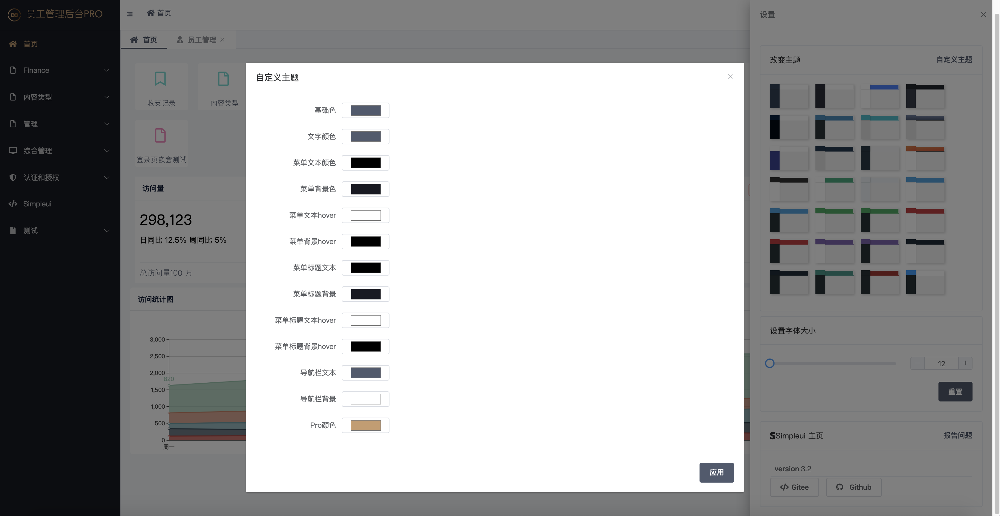
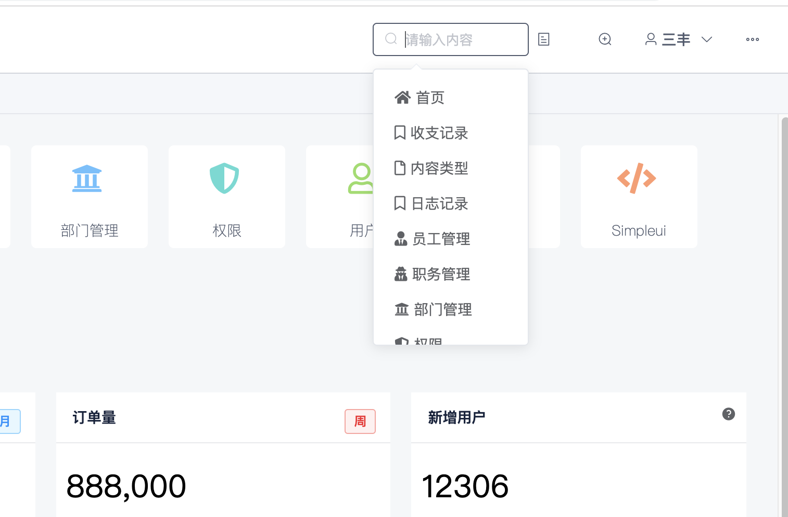
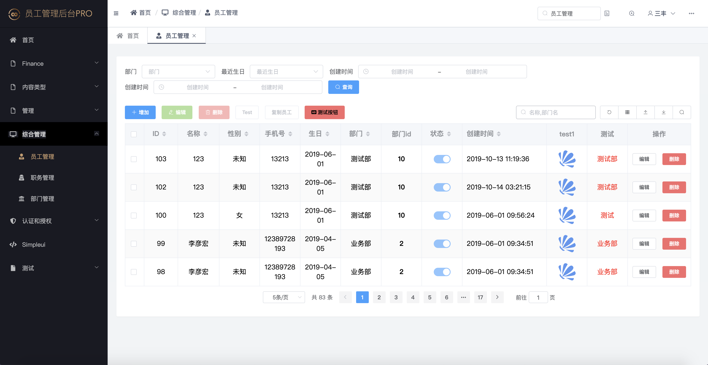
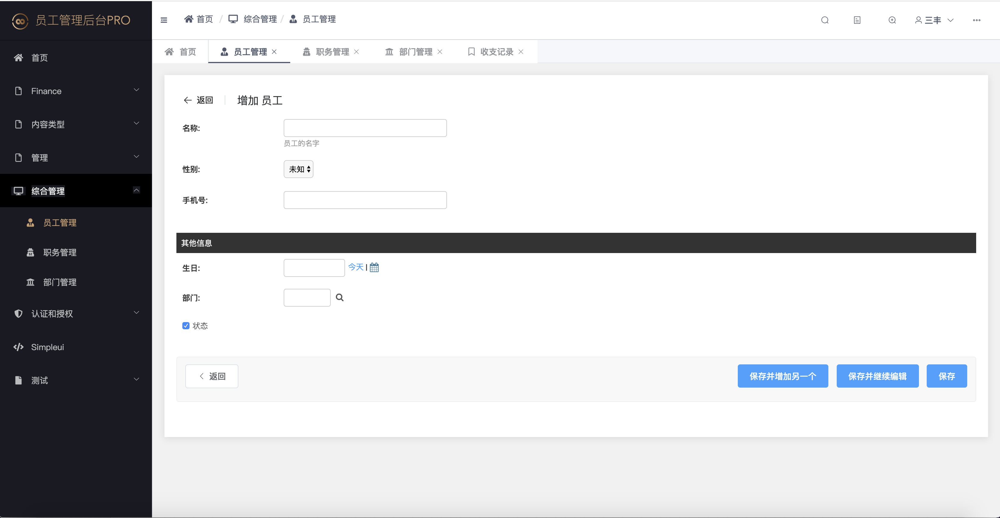
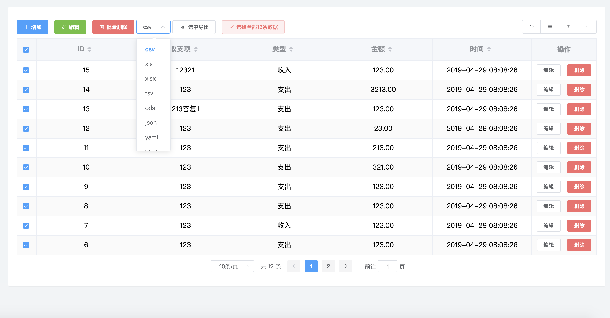
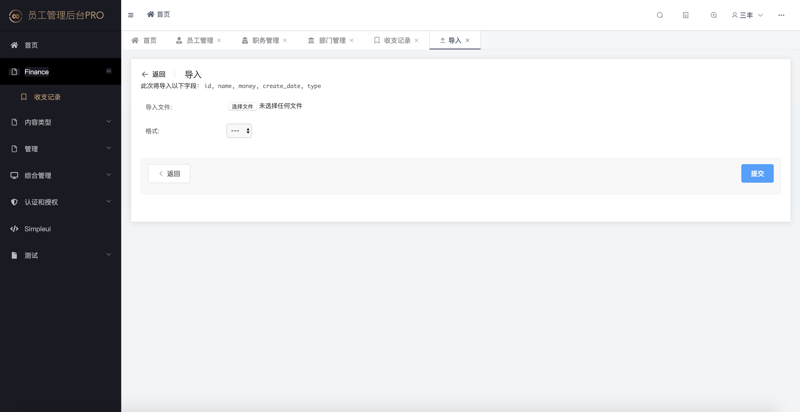
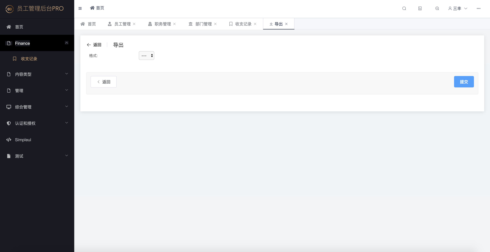
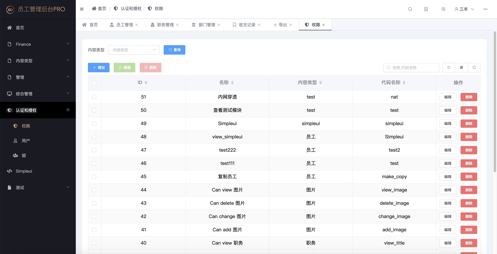

# simplepro
Simple UI Pro 专业版simple UI 前后端分离，功能更多界面更美观！
## 目前正在开发完善中预计10月18日开启内测，11月11日发布正式版
## QQ群：786576510
> Simple Pro是基于simpleui的升级版，需要依赖simpleui




Simple Pro是收费项目，如果不想付费请继续使用[Simpleui](https://github.com/newpanjing/simpleui)我们也会将开源免费的项目维护到底。收费的目的是为了让simpleui和simplepro能够更好的维护下去。

## Simple Pro Demo
[https://github.com/newpanjing/simplepro_demo](https://github.com/newpanjing/simplepro_demo)

## 预览图
+ 可自定义主题


+ 可以搜索模块


+ vue+element-ui 前后端分离加载数据


+ 编辑页面


+ 导出数据


+ 导入插件


+ 导出插件


+ 自定义权限



## 付费和激活
可以先直接安装simplepro，启动项目后打开后台会有相关提示页面，根据提示页面操作即可激活。

## 主要功能：
以下列出的功能，均是在simpleui的基础上进行的

### 页面
- 首页改版
- 登录页改版
- 列表页改版
- 权限页改版
- 导入页和导出页改版
- 增加网页全局进度条
- 替换全局部分图标
- Pro版独有标识
- 专业版主题
- 优化最近动作和主题，改为侧栏显示
- 优化返回按钮，改为绝对路径 通过reverse('admin:demo_employe_add')
- 全新默认LOGO
- 首页增加图表

### 功能
- 自定义按钮ajax实现
- 筛选、删除、搜索、表格ajax加载数据
- 导入导出优化
- 权限模块重写
- 表格功能增加详见table.md文档
- 自定义主题

### 权限
- 可添加自定义权限
- 自定义按钮权限控制
- 自定义菜单权限控制
- 自定义字段权限

## 文档
+ [安装步骤](/setup.md)
+ [主页](/home.md)
+ [图表](/charts.md)
+ [自定义按钮](/action.md)
+ [自定义权限](/permissions.md)
+ [导入导出插件](/export_import.md)
+ [表格配置](/table.md)
+ [JS SDK](/jssdk.md)


# 插件兼容
+ django_apscheduler
+ django-import-export

以上两个插件做了特定的兼容，其他插件也可以兼容。


# 隐藏 simplepro 版本和授权信息

请在settings.py中加入：
```python
SIMPLEPRO_INFO = False
```